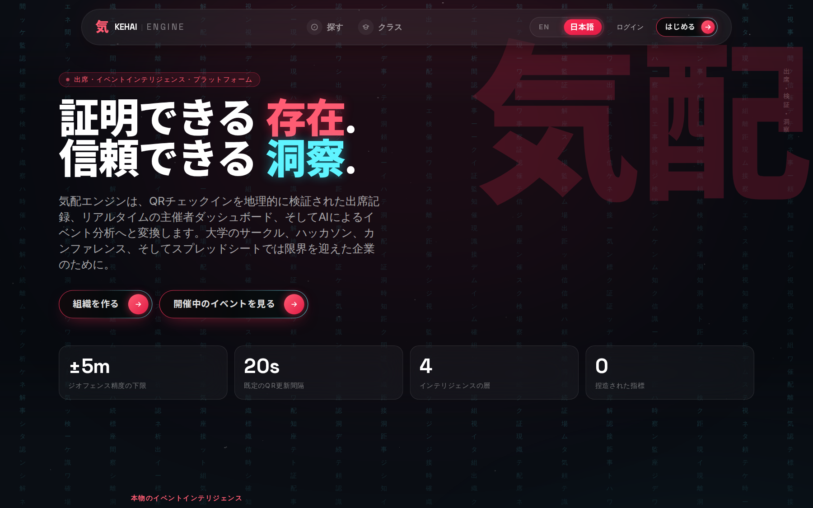
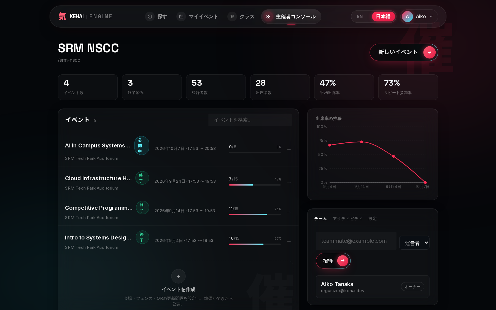
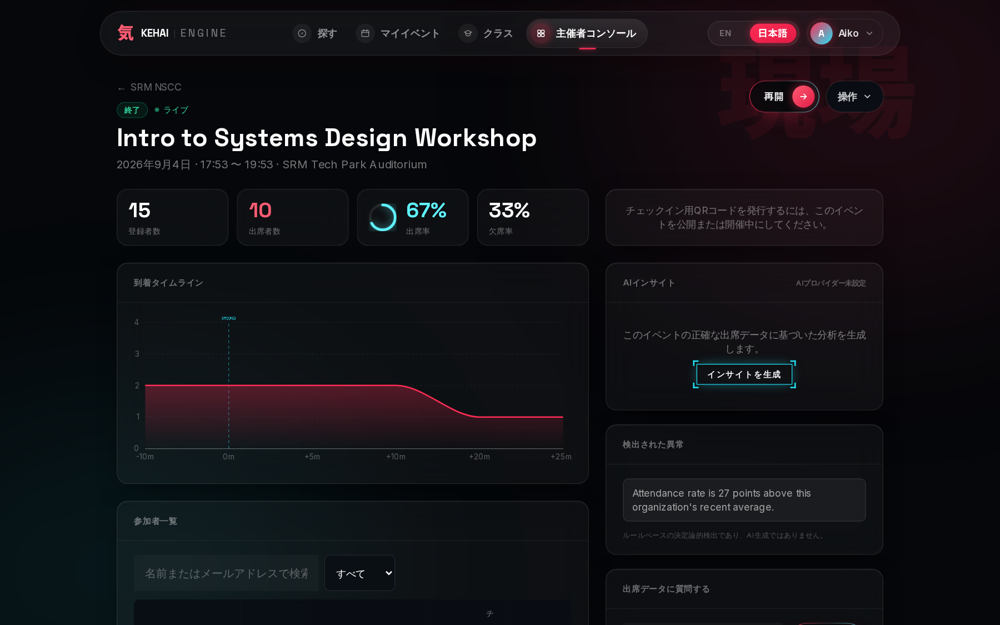
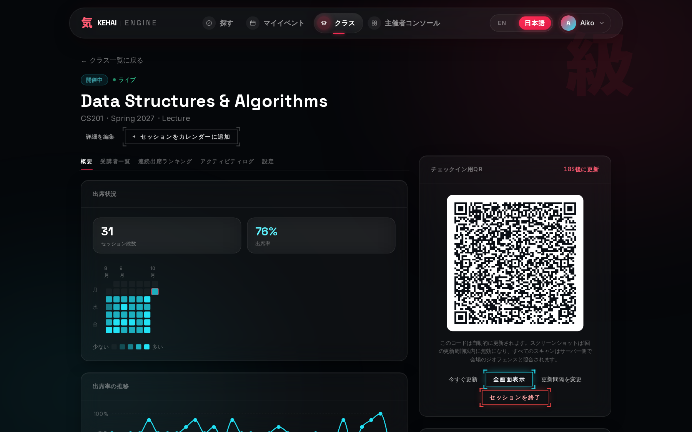
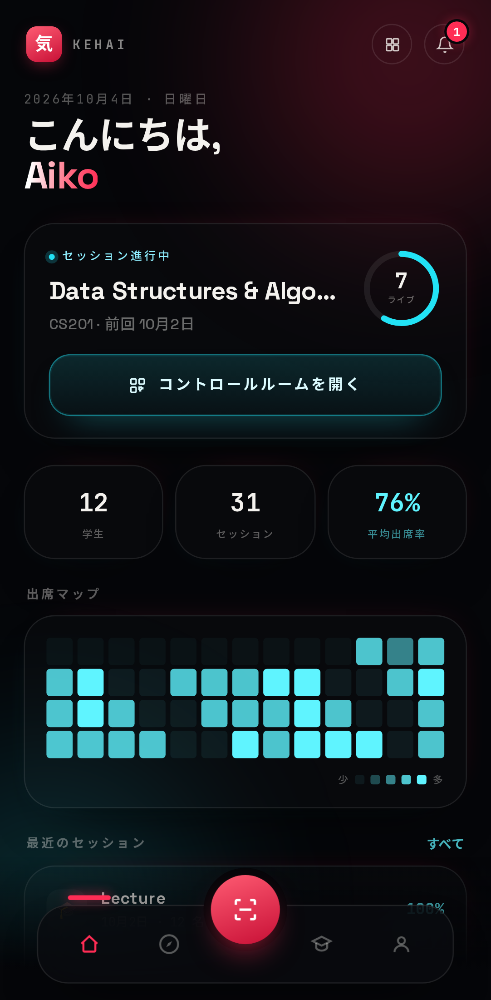
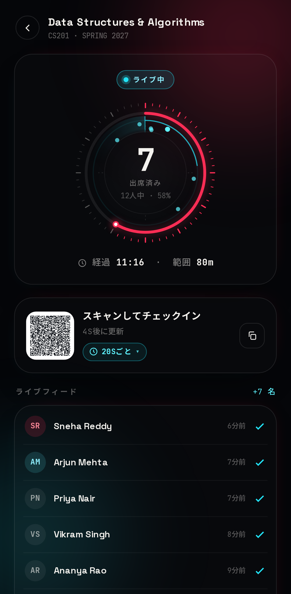
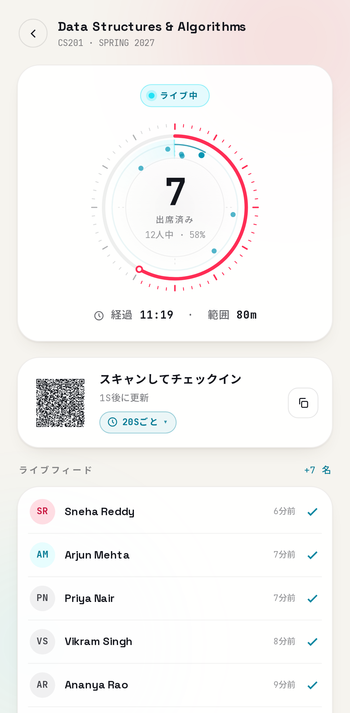
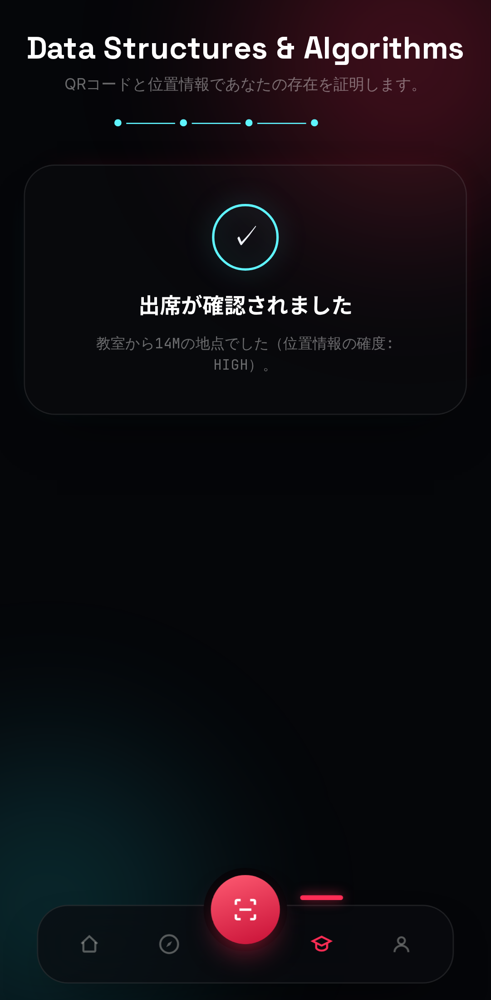

# Kehai Engine（気配）

[English](README.md) · **日本語**

> **公開中のアプリ → [kehai-engine-web.vercel.app](https://kehai-engine-web.vercel.app)**
> スマートフォンで開き、ホーム画面に追加するとアプリとして使えます。API は無料プランで稼働しているため、しばらくアクセスがないと最初のリクエストに 30〜50 秒ほどかかることがあります。

> この日本語版は英語版 README（2026 年 10 月時点）と同じ内容・構成で書かれています。内容に差がある場合は英語版が最新です。

**気配**とは、目に見える前に感じ取れる「人がそこにいる気配」のことです。このプロジェクトの核にある考え方も同じで、誰かがチェックボックスを押しただけの記録ではなく、本当にその場にいたことを確かめられる出席管理を目指しています。

Kehai Engine は、位置情報で検証する QR コードベースの出席管理・イベント分析プラットフォームです。SRM NSCC の技術系採用課題「QR-Based Geo-Tagged Attendance Management System」への回答として始まり、そこから大きく発展させました。現在はマルチテナント構成で、リアルタイムダッシュボード、決定的（deterministic）な分析、ルールベースの異常検知、そしてイベントデータを「捏造せずに解釈する」AI レイヤーを備えています。



---

## 目次

- [できること](#できること)
- [スクリーンショット](#スクリーンショット)
- [アーキテクチャ](#アーキテクチャ)
- [データモデル](#データモデル)
- [認証と認可](#認証と認可)
- [QRコードのセキュリティ](#qrコードのセキュリティ)
- [ジオフェンス検証](#ジオフェンス検証)
- [リアルタイム更新](#リアルタイム更新)
- [分析とAIのアーキテクチャ](#分析とaiのアーキテクチャ)
- [信頼性と公正性](#信頼性と公正性)
- [レート制限とログ監視](#レート制限とログ監視)
- [ローカル環境での起動](#ローカル環境での起動)
- [環境変数](#環境変数)
- [テスト](#テスト)
- [デプロイ](#デプロイ)
- [API一覧](#api一覧)
- [設計上の判断](#設計上の判断)
- [制約](#制約)
- [今後の予定](#今後の予定)

---

## できること

**主催者側**
- 組織を作成し、ロール（オーナー／管理者／主催者／閲覧者）を付けてメンバーを招待
- 下書き → 公開 → 開催中 → 終了／中止 というライフサイクルでイベントを管理
- 会場の座標、ジオフェンスの半径、定員、受付期間とチェックイン受付時間を設定
- 一定間隔で切り替わる署名付きのチェックイン用 QR コードを表示
- 出席状況をリアルタイムで確認（再読み込み不要）
- 参加者の検索・絞り込みと、必要に応じたチェックインの手動修正
- 参加者一覧を CSV または Excel で書き出し（キャンセル待ちの状態を含む）
- 手動で出席扱いにしたり、誤スキャンや操作ミスによるチェックインを取り消したり
- 登録の削除や、空きが出たら次の人を自動で繰り上げる定員連動のキャンセル待ち
- イベントの複製・削除、組織そのものの削除
- チーム管理：ロールを指定して招待、既存メンバーのロールをその場で変更、メンバーの削除
- 組織全体の操作履歴（誰が何をしたか）をページ送りで確認でき、操作の種類や実行した管理者で絞り込み可能
- 誰かがチェックインした瞬間に、クラブの Discord や Slack へ通知（Incoming Webhook の URL を 1 つ貼るだけ）
- 手動での出席修正やメンバー変更は、すべて改ざんを検知できるハッシュチェーン形式の監査ログに記録（[信頼性と公正性](#信頼性と公正性)を参照）
- 決定的な分析（出席率、無断欠席率、到着時刻の推移、到着のピーク時間帯）と、ルールベースの異常フラグ
- AI による分析の解説、イベント終了後の AI レポート、組織のイベント履歴への自然言語での質問

**参加者側**
- 公開中・開催中のイベントを閲覧
- 参加登録（定員に達した後はキャンセル待ちとなり、空きが出ると自動で繰り上げ）
- メールアドレスの確認
- 主催者の QR コードを読み取り（アプリ内のカメラスキャナー、または QR のディープリンクを直接開く）
- 位置情報を一度だけ共有し、会場までの実際の距離を確認。チェックインの成功・失敗は、具体的な理由とともに表示
- 登録の取り消しや、自分のアカウントの削除（その人が唯一のオーナーで、組織が管理者不在になる場合は削除できません）
- ホーム画面に追加してアプリとして使用：スマートフォン向けの専用画面、端末の設定に合わせたライトモード（設定画面でも選択可能）、ダークな起動画面、滑らかな画面遷移、Android での触覚フィードバック（タップ時の軽い振動、QR 読み取り時のパルス、チェックイン成功・失敗それぞれの振動パターン）

**クラス（教員側）**：単発のイベントではなく、学期を通じたクラスの出席を記録するためのもう一つのワークフローです。
- クラスを作成し、6 文字の参加コードまたはリンクを共有
- チェックイン用のセッションを何度でも開始・命名・終了・再開。同じ日の講義と小テストは、それぞれ独自の QR と記録を持つ別々のセッションとして扱います
- インストール版アプリの「コントロールルーム」でセッションを運営（登録学生のうちチェックイン済みの割合で弧が埋まるライブダイヤル、学生ごとのドット、ゆっくり回るレーダー、チェックインのフィード、切り替わる QR）。QR の切り替え間隔もその場で変更でき、カウントダウン下の「Every 20s」をタップすると、10 秒〜1 時間のプリセットや任意の間隔（5 秒〜24 時間）を選べます。選んだ瞬間に新しいコードに切り替わるため、すでに出回ったコードは使えなくなります
- 学生がクラスに参加した瞬間にリアルタイムで通知
- 学生個人とクラス全体の出席状況を、GitHub の草のようなヒートマップと、現在・最長の連続出席記録で確認
- 出席が危うい学生にメールでリマインド（週 1 回のクールダウン付きの自動送信、または手動）。参加コードの再発行やクラスの削除も可能
- 受講者一覧は学年順（卒業生・大学院生が先頭、学年の降順、未設定は最後）で、各学生の学年はその場で編集可能
- メールアドレスの一覧を貼り付けて学生を一括登録（既存アカウントにのみ一致させ、勝手にアカウントを作ることはありません）
- 受講者一覧で複数の学生を選び、まとめて出席扱いに
- 手動での出席修正をすべて記録した、クラス単位の操作履歴を確認
- 現在の連続出席 → 最長の連続出席 → 出席率の順で並ぶランキング
- クラスのセッションを `.ics` カレンダーファイルとして書き出し（実際の開始・終了時刻で、セッションごとに 1 件の予定）

**クラス（学生側）**
- コードを入力してクラスに参加。その際に学年（1〜4 年、大学院生、卒業生・OB／OG）も任意で登録可能
- イベントと同じく QR とジオフェンスでチェックイン
- 受講している各クラスについて、自分の出席ヒートマップと連続出席記録、ランキングでの順位を確認
- 教員に頼まなくても、自分でクラスから退出可能

---

## スクリーンショット

すべてシードデータ（[ローカル環境での起動](#ローカル環境での起動)を参照）を使い、日本語表示で撮影しています。英語表示のものは [README.md](README.md) にあります。

**主催者向けコンソール**

| 組織のダッシュボード | イベント分析 |
|---|---|
|  |  |

**クラス**（出席ヒートマップと、実施中の授業の QR コード）



**インストールしたスマートフォンアプリ**（ホーム画面、教員用ライブコントロールルームのダークモードとライトモード、学生のチェックイン完了画面）

<p align="center">




</p>

撮り直すときは、新しくシードしたデータベースでローカル環境を起動し、`docs/screenshots/capture.mjs` を実行してください（手順はファイルの冒頭に記載しています）。英語表示は `docs/screenshots/` に、日本語表示は `docs/screenshots/ja/` に保存されます。チェックインの画像は実際の流れをそのままたどります。教員画面の QR コードを読み取り、その中のリンクを登録済みの学生として開き、ジオフェンス内の位置情報を共有して出席を確定します。

---

## アーキテクチャ

```
Kehai-Engine/
├── apps/
│   ├── server/            Node.js + TypeScript + Express + Prisma + PostgreSQL
│   │   ├── prisma/        スキーマ、マイグレーション、シードスクリプト
│   │   ├── src/
│   │   │   ├── ai/        プロバイダー抽象化、コンテキスト生成、インサイト、自然言語クエリのルーター
│   │   │   ├── config/    Zod で検証する環境変数の設定
│   │   │   ├── lib/       構造化ロガー、エラー追跡、Prisma クライアント
│   │   │   ├── middleware/ 認証、エラー処理、レート制限、リクエスト ID によるトレース
│   │   │   ├── realtime/  Socket.io サーバー
│   │   │   ├── routes/    Express のルーター（リソースごとに 1 つ）
│   │   │   ├── services/  ビジネスロジック（認証、イベント、出席、分析、異常検知、書き出し、組織）
│   │   │   ├── utils/     ジオフェンスの計算、QR トークンの署名、JWT ヘルパー
│   │   │   └── validators/ Zod によるリクエストのスキーマ
│   │   └── tests/         Vitest：ユニットテスト、サービス単位の結合テスト、
│   │                      実際の Express アプリに supertest で HTTP を送る
│   │                      結合テスト（いずれも実際の Postgres に対して実行）
│   └── web/                Next.js 15（App Router）+ TypeScript + Tailwind
│       ├── app/            各ページ（トップ、認証、主催者コンソール、参加者フロー）
│       │                   と PWA のマニフェスト（アイコン付きでインストール可能）
│       ├── components/     UI キットと機能コンポーネント（QR スキャナー、ライブ QR パネル、グラフ、AI パネル）
│       ├── lib/             API クライアント、認証コンテキスト、リアルタイムクライアント、フック、型定義
│       ├── tests/           Vitest のユニットテスト（ライブダイヤルの配置）
│       └── e2e/             モックの API に対する Playwright のレイアウトテスト
├── docker-compose.yml
└── PRIVACY.md
```

**この技術構成を選んだ理由：** Postgres と Prisma により、特定のベンダーに縛られずに、リレーショナルな整合性とマイグレーションを確保できます。課題の要件で、Supabase や Firebase のクライアント SDK・自動生成 API の上に作ることは明確に禁止されていたため、アプリは BaaS ではなく自前の Express バックエンドと通信します。本番のデータベースは Supabase の無料 Postgres 上に置いていますが、Prisma が直接つなぐ普通の Postgres 接続文字列として使っているだけで、Supabase 固有の機能は使っていません。Express はあえて「地味」な選択で、セキュリティが重要なバックエンドを監査しやすくするためです。Socket.io は WebSocket が遮断された環境でも段階的に機能を落として動き続けます。Next.js の App Router により、トップ／紹介ページ、主催者コンソール、参加者フローという性格の異なる 3 つの体験を、別のルーターライブラリなしでファイルベースのルーティングで扱えます。PostGIS は使っていません。このくらいの規模の出席管理なら、アプリ層で Haversine 距離を計算するほうが理解・テスト・デプロイのどれもシンプルです。単純な 2 点間の距離ではなく本格的な地理空間クエリが必要になれば、後からスキーマを PostGIS に移行できます。

---

## データモデル

組織 → メンバーシップ → イベント → 参加登録／出席記録、という流れに、軽量な監査ログと AI インサイトのキャッシュが加わります。注釈付きの完全なスキーマは `apps/server/prisma/schema.prisma` を参照してください。主なポイント：

- `Event.qrSecret` はイベントごとの秘密鍵で、全体共通のペッパーと組み合わせて使います。あるイベントのトークンが漏れても、別のイベントには使い回せません。
- `AttendanceRecord` には `(eventId, userId)` の一意制約があり、二重チェックインはアプリのロジックだけでなく、データベースのレベルで防いでいます。
- `AttendanceRecord` に保存する座標は小数点以下 5 桁（約 1.1 m）に丸めています（`PRIVACY.md` を参照）。

---

## 認証と認可

- **JWT のアクセストークンとリフレッシュトークン。ログイン状態は意図的に長く保ちます。** アクセストークンの有効期限は長め（既定で 7 日）で、リフレッシュトークン（SHA-256 でハッシュ化して `RefreshToken.tokenHash` に保存）は使用のたびに**ローテーションしません**。代わりに、リフレッシュのたびに有効期限を先へ延ばします。セッションが終わるのは、明示的なログアウトか、パスワードのリセット（そのユーザーのリフレッシュトークンをすべて失効させます）のときだけで、「ログインしたままにする」という期待どおりの挙動です。当初はリフレッシュのたびにローテーションしていましたが、途中で中断されたリクエスト（リフレッシュ中の再読み込みや、2 つのタブがほぼ同時にリフレッシュした場合）によって、クライアントが失効済みのトークンを持ったままになり、意図しないログアウトが起きるため、この方式はやめました。
- **パスワードを忘れた場合の再設定**は、Resend 経由のメールで行います（`RESEND_API_KEY`。任意、「環境変数」を参照）。再設定を行うと、そのアカウントの既存セッションはすべて失効します。
- **Google OAuth 2.0** は `google-auth-library` を使い、ID トークンをサーバー側で検証します。任意の機能で、`GOOGLE_CLIENT_ID` を設定しなくても、パスワード認証だけですべての機能が使えます。
- **ロールベースの認可を、すべてのリクエストでサーバー側から強制します。** ミドルウェア `requireOrgRole(minRole)` は、呼び出しのたびに呼び出し元の `Membership` をデータベースから読み直し、クライアントが送ってきたトークンに含まれるロールを信用することはありません。ロールの強さは `VIEWER < ORGANIZER < ADMIN < OWNER` です。クラスでも同様に、`requireClassroomTeacher()` が `Classroom.teacherId` を毎回確認します。

---

## QRコードのセキュリティ

QR トークンは永続的な識別子ではなく、有効期限の短い署名付き JWT です（`apps/server/src/utils/qrToken.ts`）。

- イベントごとに専用の署名用秘密鍵を持ち、全体共通のペッパーと組み合わせて使います。
- 主催者の画面は `qrRotationSeconds`（既定で 20 秒）ごとに新しいトークンを取得し直すため、表示中のコードのスクリーンショットはすぐに使えなくなります。
- イベントの QR を失効させると（`qrRevoked`）、そのイベント向けに発行済みのトークンはすべて即座に無効になります。
- チェックインのたびに、サーバー側でトークンの対象イベント、有効期限、署名を検証します。

これは、本命の対策であるジオフェンス検証を支える多層防御の一部であって、「その場にいたことを偽造不可能な形で証明する」と主張するものではありません。スクリーンショットした QR を遠くにいる友人に送っても、有効なチェックインにするには位置情報の検証を通る必要があります。

---

## ジオフェンス検証

`apps/server/src/utils/geo.ts` では、Haversine 距離に加えて、GPS の精度を考慮した許容範囲を実装しています。実効半径は、設定したジオフェンスの半径に、端末自身が報告する GPS の精度（上限 150 m）を**足した**値です。そのため、半径の境界のすぐ外にいても ±40 m の正当な誤差がある端末は、不当に拒否されません。範囲外の値や `(0,0)`（いわゆる「ヌル島」）のような不正な座標は、その時点で拒否します。参加者の画面には、成功・失敗だけでなく実際の距離と信頼度も表示します（`app/attend/[eventId]/page.tsx` を参照）。

---

## リアルタイム更新

Socket.io（`apps/server/src/realtime/socket.ts`）は、チェックインのたびにイベント単位のルームへ `attendance:update` を送信します。主催者のダッシュボードでは、参加者数、出席率、直近の動きが再読み込みなしで更新されます。ソケットがつながらない場合、Web クライアント（`lib/realtime.ts`）は既存の SWR によるポーリング（8〜10 秒間隔）に切り替わるため、WebSocket を遮断するプロキシの内側でもダッシュボードは動き続けます。

---

## 分析とAIのアーキテクチャ

意図的に分離した 4 つの層で構成しています。

1. **決定的な分析**（`services/analytics.service.ts`）：データベースから直接計算する正確な件数と割合です。出席率、無断欠席率、到着時刻の推移、到着のピーク時間帯、チェックインまでの時間の中央値、組織全体でのリピート参加率などを含みます。
2. **ルールベースの異常検知**（`services/anomaly.service.ts`）：LLM を**一切使わない**、単純な統計的しきい値のチェックです（例：無断欠席率が 60% 以上、出席率が組織の直近平均より 20 ポイント以上低い）。検知した異常には、その理由がすべて読めるコードの形で示されます。
3. **AI による解釈**（`ai/insights.service.ts`）：第 1・第 2 層の結果を、構造化されたツール呼び出し（自由記述のテキストではなく、必ず正しい JSON を返させる方式）で Groq の API（無料プラン、クレジットカード不要）に渡し、数字の意味の説明と具体的な改善案を 1 つ生成させます。結果は `(event, contentHash)` 単位でキャッシュするため、データが変わらなければトークンを再消費しません。API キーが未設定の場合や呼び出しに失敗した場合は、決定的に作った要約を返します。**AI 層が原因でダッシュボードが壊れることはありません。**
4. **自然言語での問い合わせ**（`ai/nlQuery.service.ts`）：主催者は「出席率が一番高かったイベントは？」のように質問できます。ただし、モデルがクエリを書いたり実行したりすることは**決してありません**。モデルは、強制された構造化ツール呼び出しによって、質問を少数の決められた意図（`org_overview`、`best_event`、`worst_no_show`、`compare_events` など）のいずれかに分類するだけです。対応する決定的な Prisma の関数をバックエンドが実行し、その*正確な*結果を、読みやすい文章にするためだけにモデルへ返します。この仕組みにより、数字のハルシネーションや SQL インジェクションは構造的に起こり得ません。モデルが、実際の計算から得られていない数字を出すことはできないのです。

**データの最小化：** AI 層が受け取るのは、すでに集計済みの指標だけです（`ai/context.ts`）。参加者の名前、メールアドレス、生の座標は一切渡しません。`PRIVACY.md` を参照してください。

**プロバイダーの抽象化：** AI の呼び出しはすべて `ai/provider.ts`（`structuredCall`／`textCall`）を経由します。プロバイダーの変更や追加は、このファイル 1 つを変えるだけで済みます。

---

## 信頼性と公正性

このアプリを運用する人は、そのデータベースを自由に操作できます。これは誰がホストする出席管理システムでも同じで、アプリのコードでそれを技術的に不可能にすることはできません。そこでこのアプリでは、手動での出席修正と組織メンバーの削除をすべて `appendAuditLog()`（`apps/server/src/utils/auditLog.ts`）経由で追記専用の `AuditLog` テーブルに書き込み、コードベースのほかの箇所からこのテーブルに書き込むことはありません。

各行の `hash` は、その行自身の内容と*直前の*行のハッシュから計算した SHA-256 で、行同士が鎖のようにつながっています。過去の行を編集・削除すると（API 経由だけでなく、データベースを直接操作した場合も）、それ以降のハッシュがすべて合わなくなります。`verifyAuditLogChain()` はテーブル全体をたどり直して各ハッシュを再計算し、鎖が壊れていないことを確認します。この検証結果は、認証なし・行の中身なしで `GET /api/audit/verify` から取得でき、公開ページ [`/trust`](apps/web/app/trust/page.tsx) にもライブで表示されます。クラブ、プログラムのコーディネーター、疑い深い学生など、誰でも鵜呑みにせず自分で鎖の状態を確かめられます。メタデータは、キーを再帰的に並べ替えてから文字列化した上でハッシュ化しています。Postgres の JSONB はオブジェクトのキーの順序を保持しないため、そうしないと誰も触れていない行まで「改ざんあり」と誤判定されてしまうからです。

組織には組織単位の監査ログ（`GET /api/orgs/:orgId/audit-log`、管理者以上）が、クラスには手動での出席修正の監査ログ（`GET /api/classrooms/:classroomId/audit-log`、教員のみ）があります。プログラム側は自分たちのコーディネーターを管理者や教員として追加すれば、書き出したデータを信用するのではなく、自分でログを確認できます。どちらもカーソル方式のページ送りで返し、組織のログは操作の種類（`GET /api/orgs/:orgId/audit-log/actions` で絞り込みに使える操作の一覧を取得できます）や、操作した管理者で絞り込めます。

---

## レート制限とログ監視

- **クラスの参加コードにはレート制限をかけています。** 6 文字のコードはエントロピーが低く、無制限に試せれば総当たりで当てられてしまいます。そのため `POST /api/classrooms/join` は、ログイン中のアカウント単位で制限しています（15 分あたり 10 回）。多数の IP アドレスに試行を分散しても回避できません。
- **本番では構造化ログ、開発中は読みやすいテキスト。** `apps/server/src/lib/logger.ts` は、`NODE_ENV=production` のときは（ログ集約サービスが解析できる）JSON を、それ以外では人が読みやすい 1 行を出力します。
- **リクエスト ID によるトレース。** `apps/server/src/middleware/requestId.ts` は、受け取った `X-Request-Id` ヘッダーを使うか新たに生成し、すべてのレスポンスで返します。500 エラーの JSON 本文にも含めるため、ユーザーから報告されたエラーを、該当するサーバーログの行まで直接たどれます。
- **任意のエラー追跡。** `apps/server/src/lib/errorTracking.ts` は Sentry を `SENTRY_DSN` の設定に応じて使います。未設定の場合、`captureException` と `initErrorTracking` は本当に何もしません。どこにも送信されず、何も壊れません。

---

## ローカル環境での起動

必要なもの：Node 22 以上、pnpm、PostgreSQL（または Docker）。

```bash
pnpm install

# 1. データベース
createdb kehai_engine   # または docker-compose up postgres
cp apps/server/.env.example apps/server/.env
# apps/server/.env を編集し、DATABASE_URL を設定して秘密鍵を生成する：
#   openssl rand -hex 32   （JWT_ACCESS_SECRET / JWT_REFRESH_SECRET 用）
#   openssl rand -hex 16   （QR_SIGNING_PEPPER 用）

pnpm --filter server prisma:migrate
pnpm --filter server db:seed   # デモ用の組織、イベント、参加者、クラスを作成

# 2. Web
cp apps/web/.env.example apps/web/.env.local

# 3. 両方を起動
pnpm dev:server   # http://localhost:4000
pnpm dev:web      # http://localhost:3000
```

シードで作られるデモ用ログイン：`organizer@kehai.dev` / `Password123!`
（参加者アカウントは `<名>.<姓>@students.kehai.dev` で、パスワードは同じです。一覧は `apps/server/prisma/seed.ts` を参照してください。）

シードでは、主催者アカウントのデモ用クラス「Data Structures & Algorithms」（CS201）も作成されます。受講者は 12 人で、過去 6 週間の平日の授業（終了済み）と出席記録、さらに現在実施中の授業が 1 つ含まれるため、ヒートマップ、連続出席記録、ランキング、ライブコントロールルームに最初からデータが表示されます。

---

## 環境変数

コメント付きの全一覧は `apps/server/.env.example` と `apps/web/.env.example` にあります。ハードコードしている値はなく、URL や秘密鍵はすべて環境変数で設定します。AI 機能（`GROQ_API_KEY`。無料プラン・クレジットカード不要で、console.groq.com/keys から取得）、Google ログイン（`GOOGLE_CLIENT_ID`）、パスワード再設定メール（`RESEND_API_KEY`。無料プラン・クレジットカード不要で、resend.com/api-keys から取得）はすべて任意で、どれがなくてもプラットフォームは完全に動作します（パスワード認証はそのまま使え、メール用のキーが未設定の場合、再設定のリンクはメールで送る代わりにサーバーのログに出力されます）。

---

## テスト

```bash
pnpm --filter server test     # API（Postgres が必要）
pnpm --filter web test        # Web のユニットテスト
pnpm --filter web test:e2e    # 実際のブラウザでの Web のレイアウトテスト
```

27 ファイル・185 件のテスト（Vitest）で、主に次の内容を確認しています。

- ジオフェンスの計算（精度による半径の拡張の境界ケースや、不正な座標の拒否を含む）
- イベントとクラスのセッション両方の QR トークンの署名と検証（別イベントのトークンの拒否、有効期限、改ざんへの耐性）
- 実際の Postgres に対する、二重チェックインの防止、ジオフェンス外での拒否、出席の取り消し
- イベントのライフサイクルにおける状態遷移の妥当性、参加コードの生成と再発行、連続出席の計算、分析結果の正しさ
- 行ロックを使ったトランザクション内でのキャンセル待ちの繰り上げ、メール確認用トークンのライフサイクル
- アカウントやクラスを自分で削除する際の安全装置、組織のロール変更の認可（管理者はオーナーや同格の管理者のロールを変えられない）
- Discord／Slack への Webhook 送信（送信先が失敗・到達不能でも例外を投げず、プライベート・内部・メタデータ用のアドレスへは送信を拒否する）と URL の検証
- 監査ログのハッシュチェーン（JSONB のキー順の変化に影響されず、後から編集・削除された行を検出する）と、そのページ送り・絞り込み
- 認証セッションのライフサイクル（リフレッシュ時に非ローテーション、ログアウトによる失効、パスワード再設定で全セッションが失効）
- 受講者の一括登録、クラスの `.ics` 書き出し、クラスのランキング（連続出席と出席率による順位）

これとは別に、`tests/http.integration.test.ts` は、サービスの関数を直接呼ぶのではなく、実際の Express アプリ（`createApp()`）に supertest で本物の HTTP リクエストを送ります。配線のミスを見つけられるのはこの層だけです。たとえば、ミドルウェアの登録順の誤り、より汎用的なルートに隠されてしまうルート（`/mine` と `/:eventId`）、HTTP の境界で実際には効いていない認証、エラーハンドラーが返す本当のレスポンス形式などです。

フロントエンド：インストール版アプリのライブダイヤルは、テストできるように図形の配置を `lib/liveDial.ts` にまとめています。ユニットテスト（Vitest、`tests/`）では、生成した 20,000 件の ID（ハッシュの最上位ビットが立つものを含む）について、学生のドットがすべて人数表示を囲む帯の中に収まること、桁数が増えたら数字が縮んで収まることを確認します。以前は符号付きシフトのせいで、ドットの約半数が数字の真ん中に置かれていました。レイアウトテスト（Playwright、`e2e/`）は、API をモックにして実際のコントロールルームを描画するので、データベースは不要です。英語と日本語、ダークとライト、通常の動きと「視差効果を減らす」、0〜120 人のクラスを組み合わせた 56 ケースで、実際にピクセルが描かれた位置を測ります。人数・ラベル・「N人中」の行が、中央の何も描かれない円の中に、互いに重ならずに中央揃えで収まっていること、そしてダイヤルの描画（ガイドの輪、学生のドット、止まったままのアニメーションの輪など）がその円の中のピクセルを 1 つも変えないことを確認します。Playwright が Web アプリを自動で起動します。起動中のアプリをテストする場合は `E2E_BASE_URL` を指定してください。

`pnpm --filter web build` で、型チェックを含む本番ビルドを実行します。一連のデモフロー（登録 → 組織作成 → イベント作成 → 公開 → 開催 → QR 発行 → 参加登録 → チェックイン → 二重チェックインの拒否 → ジオフェンス外の拒否 → 分析 → CSV 書き出し）は、起動中のサーバーに対して手作業でエンドツーエンドに検証済みで、主催者コンソールの全ページも実際のブラウザで見た目を確認しています。

---

## デプロイ

`docker-compose.yml` は、Postgres、API、Web アプリをローカルでビルドして起動します。本番環境では、`WEB_ORIGIN`（サーバー側）と `API_URL`（Web 側。*コンテナの実行時*に読み込みます。後述の「API の URL を実行時に読み込む理由」を参照）を実際のドメインに向け、`prisma migrate deploy` を実行してください（サーバーの Docker の `CMD` にすでに組み込まれています）。一般的なコンテナホスト（Fly.io、Railway、Render、VPS など）であれば、どこでも動きます。特定のプラットフォーム独自のサービスには依存していません。

`JWT_ACCESS_SECRET`、`JWT_REFRESH_SECRET`、`QR_SIGNING_PEPPER` には、`docker-compose.yml` であえて既定値を設けていません。これらはすべての認証トークンと QR チェックイン用トークンの署名に使われるため、便利なフォールバック値を置くと、設定を忘れたデプロイに対して、この公開リポジトリを読んだ誰もがトークンを偽造できてしまいます。起動する前に、生成した本物の値（`openssl rand -hex 32`）を `docker-compose.yml` と同じ場所の `.env` ファイルに記入してください（compose が自動で読み込みます）。設定されていない場合、`docker compose up` は起動を拒否します。

```bash
docker compose up --build
```

### 本番の構成（Supabase + Render + Vercel に分けてホスト）

データベースは Supabase、API は Render、Next.js のフロントエンドは Vercel で動かしています。Vercel は Next.js の開発元によるホスティングで、Docker を使わずにそのまま扱えます。汎用的なコンテナホストでモノレポを扱う際に起きがちな、pnpm ワークスペースと Docker のパッケージングにまつわる問題をまとめて回避できます（Render だけで構成しようとした際にいくつも遭遇しました。詳しくは `render.yaml` と両方の Dockerfile の Git 履歴を参照してください。最大の問題は、実行用イメージにワークスペースのルートのファイルがないと、pnpm の `exec` が依存関係の再インストールを丸ごとやり直してしまうことでした）。

**データベースを Render に置かない理由：** 当初は Render の Blueprint で作った Postgres インスタンスに置いていました。しかし Render の無料 Postgres は、有料プランに切り替えない限り **90 日で削除されます**。学期を通じて出席の履歴を蓄積するプラットフォームにとっては大きな問題です。Supabase の無料 Postgres にはそのような期限がありません（しばらく利用がないと一時停止しますが、削除はされず、ダッシュボードからワンクリックで再開できます）。Prisma が必要とするのは普通の Postgres 接続文字列だけなので、プロバイダーの移行は `DATABASE_URL` を 1 行変えるだけで済みます。スキーマやコードの変更は不要で、どちらの方向にもベンダーロックインはありません。

**1. Supabase でデータベースを用意する**

1. [supabase.com](https://supabase.com) で無料のプロジェクトを作成します。
2. ダッシュボード上部の **Connect** をクリックし、「Direct connection」ではなく **Session pooler** の接続文字列をコピーします。Supabase の直接接続用のホスト名は既定で IPv6 のみに解決されるため、一部のホスト（CI やコンテナ環境の一部を含む）からは到達できません。Session pooler は IPv4 に対応しており、どこからでもつながります。接続文字列には、プロジェクト作成時に設定したデータベースのパスワードを入れてください。
3. パスワードに `@ : / ? # &` のいずれかが含まれる場合は、接続文字列内のその文字だけを URL エンコードしてください（例：`@` → `%40`）。これらの文字は URI の構文そのものに使われるため、パスワードにそのまま含まれると解析が壊れます。

**2. Render で API を動かす**

リポジトリのルートにある `render.yaml` は、API サービスを作成する [Render Blueprint](https://render.com/docs/blueprint-spec) です。

1. このリポジトリを自分の GitHub アカウントに push します（フォークまたはコピー）。
2. [render.com](https://render.com) で **New +** → **Blueprint** を選び、リポジトリを接続します。Render が `render.yaml` を読み込んでプレビュー（`kehai-engine-api`）を表示するので、**Apply** をクリックします。
3. `kehai-engine-api` → **Environment** を開き、`DATABASE_URL` に手順 1 の Supabase の接続文字列を設定します。秘密鍵（`JWT_ACCESS_SECRET`、`JWT_REFRESH_SECRET`、`QR_SIGNING_PEPPER`）は Render が自動生成するため、Git にはコミットされません。
4. 任意で、`GROQ_API_KEY`（AI 機能を有効化。console.groq.com/keys から無料、クレジットカード不要）、`GOOGLE_CLIENT_ID`（Google ログインを有効化）、`RESEND_API_KEY`（確認・再設定メールを有効化。resend.com/api-keys から無料）も設定します。3 つとも既定では空欄で、どれがなくてもプラットフォームは完全に動作します。
5. 発行された API の URL（例：`https://kehai-engine-api.onrender.com`）を控えておきます。次の手順 3 で使います。

**3. Vercel でフロントエンドを動かす**

1. [vercel.com](https://vercel.com) で **Add New** → **Project** を選び、同じリポジトリをインポートします。
2. **Root Directory** を `apps/web` に設定します（そこから先は Vercel のモノレポ対応が pnpm ワークスペースを正しく扱うため、追加の設定は不要です）。
3. 環境変数 `API_URL` に、手順 2 の Render の API の URL を設定します。
4. デプロイします。Vercel が発行する `https://your-project.vercel.app` のような URL が、共有用のアドレスになります。
5. Render の `kehai-engine-api` → **Environment** に戻り、`WEB_ORIGIN` にその Vercel の URL を設定します（CORS とリアルタイム用ソケットの接続を、そのドメインから受け付けるために必要です）。

**無料プランのトレードオフ（正直に書きます）：** Render の無料 API サービスは、**15 分間アクセスがないと停止します**（次のリクエストはコールドスタートのため 30〜50 秒ほど待たされます）。初めて開く人の多い場所でリンクを紹介する前に知っておく価値があります。Supabase の無料 Postgres は、まったく利用がない状態がしばらく続くと一時停止します（削除はされません）が、定期的にチェックインが行われる実際のイベントがあれば、そうなることはありません。フロントエンドの Vercel の無料プランには、こうした停止や期限はありません。また、Render や Supabase などのいくつかのプラットフォームは、学生・教育目的のプロジェクトに無料枠や割引を申請に応じて提供しているので、支払う前に確認する価値があります。

### API の URL を実行時に読み込む理由

Next.js は通常、`NEXT_PUBLIC_*` の環境変数を**ビルド時**に JavaScript のバンドルへ埋め込みます。つまり、Docker イメージを作る前に API の URL がわかっている必要があり、サービスの URL が名前を付けるまで決まらない Render のようなプラットフォームでは扱いにくくなります。そこで `apps/web/app/layout.tsx` は、サーバー側の通常の環境変数 `API_URL` を（ビルド時ではなく）**リクエストのたびに**読み込み、クライアントコンポーネント `components/ApiBaseSetter.tsx` に渡します。このコンポーネントが、ほかの何よりも先に `lib/api.ts` のメモリ上の API ベース URL を設定します。ルートレイアウトには `export const dynamic = "force-dynamic"` を指定しており、これは Next.js が、誤った（または欠けた）ビルド時の値を埋め込んだまま、ページを静的に事前レンダリングしてしまうのを防ぐためです。`NEXT_PUBLIC_API_URL` も、ローカル開発用の便利なフォールバックとして引き続き使えます（`next dev` には別のビルド工程がないため、この問題は起きません）。

---

## API一覧

すべてのルートは `/api` の下にあります。代表的なエンドポイント：

| メソッド | パス | 内容 |
|---|---|---|
| POST | `/api/auth/register`, `/login`, `/google`, `/refresh` | 認証 |
| POST | `/api/auth/forgot-password`, `/reset-password` | パスワードの再設定（常に 200 を返し、アカウントの有無を推測させない） |
| GET | `/api/auth/me` | 現在のユーザーと所属組織 |
| POST | `/api/orgs` | 組織の作成 |
| POST | `/api/orgs/:orgId/events` | イベントの作成（主催者以上） |
| POST | `/api/events/:eventId/status` | ライフサイクルの状態遷移 |
| GET | `/api/events/:eventId/qr` · `/api/qr/events/:eventId/qr-image` | 切り替わるチェックイン用トークン／QR 画像の発行 |
| POST | `/api/events/:eventId/register` | 参加者の登録（定員に達すると自動でキャンセル待ち） |
| DELETE | `/api/events/:eventId/registrations/:userId` | 登録の取り消し（次のキャンセル待ちの人を繰り上げ） |
| POST | `/api/attendance/:eventId/checkin` | QR とジオフェンスで検証するチェックイン |
| POST | `/api/attendance/:eventId/override` · DELETE `/attendees/:userId` | 手動での出席扱い／チェックインの取り消し |
| DELETE | `/api/orgs/:orgId` · `/api/classrooms/:id` | 組織／クラスの削除 |
| PATCH | `/api/orgs/:orgId/webhook` | Discord・Slack へのチェックイン通知用 Webhook の設定・解除（管理者以上） |
| GET | `/api/orgs/:orgId/audit-log` · `/audit-log/actions` | ページ送り・操作種別での絞り込みに対応した操作履歴（管理者以上） |
| GET | `/api/analytics/events/:eventId` | 決定的な指標 |
| GET | `/api/analytics/events/:eventId/anomalies` | ルールベースの異常 |
| GET | `/api/ai/events/:eventId/insights` · `/report` | AI による解説／レポート |
| POST | `/api/ai/orgs/:orgId/ask` | 自然言語での問い合わせ |
| GET | `/api/export/events/:eventId/attendees.csv` · `.xlsx` | 書き出し |
| POST | `/api/classrooms` · GET `/mine` · `/enrolled` | クラスの作成／一覧 |
| POST | `/api/classrooms/join` | 6 文字のコードでクラスに参加 |
| GET/POST/PATCH | `/api/classrooms/:id/sessions[/:sessionId]` | セッションの一覧、開始、名前の変更、QR の切り替え間隔の変更 |
| POST | `/api/classrooms/:id/sessions/:sessionId/close` · `/reopen` | セッションの終了／再開 |
| GET | `/api/classrooms/:id/sessions/:sessionId/qr` | そのセッションの切り替わる QR 画像の発行 |
| POST | `/api/classrooms/:id/checkin` | QR とジオフェンスで検証するチェックイン |
| GET | `/api/classrooms/:id/heatmap` · `/roster` | 出席ヒートマップ／学生ごとの受講者一覧 |
| POST | `/api/classrooms/:id/students/bulk` | 貼り付けたメールアドレスの一覧で学生を一括登録（教員のみ） |
| GET | `/api/classrooms/:id/leaderboard` | 連続出席・出席率によるランキング |
| GET | `/api/classrooms/:id/calendar.ics` | セッションを `.ics` カレンダーファイルとして書き出し |
| GET | `/api/classrooms/:id/audit-log` | クラス単位でページ送りに対応した操作履歴（教員のみ） |

---

## 設計上の判断

- **PostGIS は使わない**：この規模では、会場までの距離ならアプリ層の Haversine で十分で、デプロイもシンプルに保てます。「アーキテクチャ」を参照してください。
- **固定ではなく切り替わる QR**：元の課題の仕様に対して、最も効果の大きいセキュリティ上の改善です。独自の暗号ではなく、標準的な JWT の仕組みで実装しています。
- **AI には数字を計算させない**：AI 層の設計上の選択（構造化されたツール呼び出し、意図による振り分け、集計値だけを渡すコンテキスト）はすべて、統計値のハルシネーションを「起こりにくくする」のではなく、構造的に「起こり得なくする」ためのものです。
- **あらゆる箇所で段階的に機能を落とす**：AI、リアルタイム更新、Google ログインはすべて任意で、どれも設定しなくてもプラットフォームを完全に使えます。
- **一覧系のエンドポイントには上限を設ける**：イベントの検索、受講者一覧、参加者一覧、組織のイベント一覧のクエリには、すべて `take` による上限があります。大きな組織でも、一覧のエンドポイントがテーブル全体のスキャンになることはありません。
- **画面の切り替えで真っ暗にならない**：インストール版アプリでは以前、タブを切り替えると一瞬暗くなってから次のページがフェードインしていました。原因は 2 つありました。画面遷移の View Transition が古いページと新しいページを同時にフェードさせていたため、途中でどちらも完全には表示されていなかったこと、そしてインストール版の画面が、表示のたびにパネルを透明な状態からフェードインさせていたことです。現在は、遷移先のページが最初のフレームから下に完全に不透明な状態で表示され、その上で遷移元のページが奥へ下がりながら消えていきます。また、インストール版の登場アニメーション（PWA 画面のパネルのフェードアップと、共通の `.page-stagger` によるセクションのせり上がり。どちらも不透明度 0 から始まっていました）は、アプリを開いたときにだけ再生します（アプリ内で最初に画面を移動した後、`PageTransition` が `html[data-navigated]` を付けます）。ブラウザ版のサイトでは、順番に現れる登場アニメーションをそのまま残しています。`useIsStandalone` は `useSyncExternalStore` を使っているため、アプリ内の移動で表示されたページは、最初の描画の時点でインストール版であることを判別できます。合成後のフレームで測定したところ、以前は切り替え中の最も暗いフレームが前後のページより約 30% 暗くなっていましたが、現在は 2 つのページの通常のクロスフェードの範囲に収まっています。
- **アプリアイコンと起動画面**：インストール版アプリは、アプリ本体と同じほぼ黒の色（`background_color`／`theme_color` が `#05070a`）で起動し、ページの最初の描画もすでに暗い状態（`<html>` にインラインで背景色を指定）なので、起動画面とアプリの間に白い画面が挟まりません。アイコンはフラットなマークで、全面黒（`void-950`）の正方形に赤い「気」（Noto Sans JP Bold、`shu-500`）を置いたもので、光彩やグラデーションはありません。文字は中央 80% の範囲に余裕をもって収めているため、どのランチャーが円形や角丸に切り抜いても欠けません。Apple 用のアイコンも全面塗りで、通知にはシルエットのバッジを使います。
  **マスカブルアイコンはあえて使っていません。** Samsung Internet には、マニフェストにマスカブルアイコンが含まれていると、起動画面でそのアイコンを切り抜いて白い四角の上に描き、`background_color` を無視するという既知の不具合があります。ユーザーエージェントを見て Samsung にだけ別のマニフェストを返しても、インストール用のパッケージはサーバー側がマニフェストを自分で取得して作るため、効果がありません。全面塗りの「any」アイコンだけにすることで、起動画面は黒い背景に黒いアイコンになります。ファイル名も新しくした（`/icons/kehai-square-*.png`）ため、古いアイコンが端末やキャッシュに残ることもありません。すでにインストール済みのアプリは、インストール時の起動画面のままなので、新しいものにするにはホーム画面から削除して追加し直してください。
- **ライトモード（インストール版アプリのみ）**：インストール版アプリは端末のライト／ダークの設定に従い、設定 → 外観で「自動」「ライト」「ダーク」に固定することもできます（端末に保存されます）。ブラウザのタブでは、スマートフォンでもパソコンでも常にダークのままです。切り替わる色はすべて CSS 変数で、Tailwind の `white`、`void-*` と、ライトモード用のアクセントの濃淡は `--kc-*`（`globals.css`）を、インストール版の画面は `--pwa-*`（`pwa.css`）を参照します。ダーク時の値は元の色そのままなので、ダークモードの見た目は以前とまったく変わりません。`html[data-theme="light"]` のときは、温かみのある紙のような地色、ほぼ黒の文字色、明るいページでも文字として読める深めのアクセント色に切り替わります。ライトモードでは薄い文字の不透明度を少し上げて（`--kc-text-boost`）ラベルを読みやすくし、ダークモードの枠線だけのパネルの代わりに、ほぼ不透明な白いカードを使います。奥行きは、画面の真上にある 1 つの光源を前提にしています。浮き上がった面はすべて、接地部分の小さく濃い影と、真下に落ちる柔らかい影を落とし（カードよりも、浮いているドックやシートのほうが影が長くなります）、影の色は紙の地色からとった温かみのあるグレーです。ダークモードのピンクとシアンの角の光彩は、明るいページでは 2 方向から光が当たっているように見えてしまうため、ライトモードでは使いません。QR コードと全画面の QR 表示には固定の `paper`／`ink` の色を使うため、どちらのテーマでも白地に黒で表示されます。`<head>` 内の小さなインラインスクリプト（`lib/theme-boot.ts`）が最初の描画の前にテーマを決めるため、誤ったテーマが一瞬表示されることはなく、ステータスバーの色も合わせて設定します。アプリを開いている間に端末のテーマが切り替わった場合は、`ThemeSync` が追従します。起動画面はどちらのテーマでもダークのままです。変更の前後で 20 画面（パソコン、スマートフォンのブラウザ、インストール版アプリ）のスクリーンショットを撮って比較し、新しく追加した設定の行を除いて、ダークモードがピクセル単位で同一であることを確認しました。
- **触覚フィードバック（スマートフォン）**：振動のパターンは `lib/haptics.ts` にまとめ、レイアウトに一度だけ配置する `components/HapticsLayer.tsx` が、ボタン、リンク、タブ、スイッチ、チェックボックス、リストの行への指でのタップに、軽い**タップ**（8 ms）の振動を返します。マウスやペンでは振動しません。振動するのは本当のタップのときだけで、たまたまボタンの上から始まったスクロールでは振動しません。指が 10 px 以上動かずに同じ要素の上で離れたときにタップと確定し、ブラウザがスクロールのためにタッチを引き取った時点（`pointercancel`）で取り消します。重要な場面には専用のパターンがあり、スキャナーが **QR コードを読み取った**ときは 2 回のパルス、チェックインが確定したとき（イベント・クラスとも）は**成功**のパターン、拒否されたとき、コードが無効なとき、通信に失敗したときは長めの**エラー**のパターンです。Vibration API（Android の Chrome、Samsung Internet、Firefox）を使っています。iPhone の Safari はこの API をウェブサイトに提供していないため、そこでは何もしません。スマートフォンを模したブラウザで、実際のタッチ入力によって要求されたすべての振動を記録して検証しました。タップ → `[8]`、ボタンの上から始めたスワイプ → 振動なしでスクロール、マウスのクリック → 振動なし、チェックインの確定 → タップの後に成功、チェックインの拒否 → タップの後にエラー、という結果です。

## 制約

- ジオフェンスの検証は、ブラウザの Geolocation API が報告する位置を信頼しています。物理的にその場にいたことの暗号学的な証明ではありません（root 化した端末で GPS を偽装すれば、偽の位置を報告できます）。完全で率直な説明は `PRIVACY.md` を参照してください。
- 現在の UI は英語と日本語の 2 言語に対応しています。多言語対応の仕組み（`apps/web/lib/i18n.tsx`）はドット区切りのキーによるフラットな辞書なので、3 つ目の言語の追加は作り直しではなく追記（ロケールの列を 1 つ増やすだけ）で済みます。初めて訪れた人のブラウザが日本語に設定されていれば、自動的に日本語で表示されます（`navigator.language`）。自分で言語を切り替えた人には、その選択を以後も記憶します。
- ネイティブのモバイルアプリはありません。参加者向けの機能は、ブラウザのカメラと位置情報の API を使う、モバイルに最適化された Web アプリです。

## 今後の予定

- 定期開催のイベントや、イベントシリーズ単位の分析
- 組織ごとに設定できる異常検知のしきい値
- 一定期間が過ぎたチェックインの生の座標を消去する保存期間ジョブ（`PRIVACY.md` を参照）
- *イベント*の参加者リストを事前登録するための CSV 一括インポート（クラスでは受講者の一括登録にすでに対応）
- 無料プランでホストしていることのトレードオフを正直に説明し、利用が増えたときに必要な部分を有料プランにするための寄付リンク（Ko-fi など）を添えた、「このプロジェクトを支援する」セクションを UI に追加
